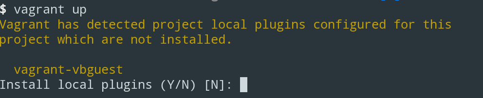
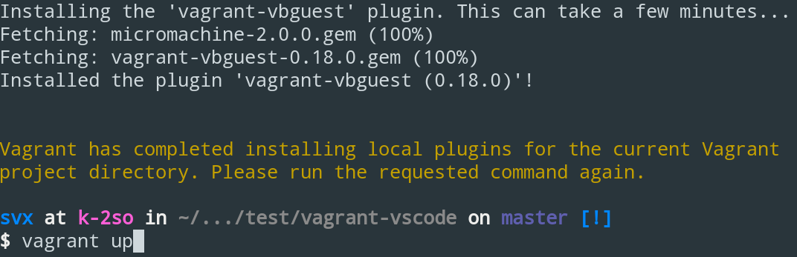

<!-- PROJECT LOGO -->
<br />
<p align="center">
  <a href="https://github.com/ocular-d/vagrant-vscode">
    
  </a>

  <h3 align="center">Vagrant VSCode</h3>

  <p align="center">
    Visual Studio Code Demo For Technical Writing
    <br />
    <a href="https://github.com/ocular-d/vagrant-vscode"><strong>Explore the docs »</strong></a>
    <br />
    <br />
    <a href="https://github.com/ocular-d/Best-vagrant-vscode/issues">Report Bug</a>
    ·
    <a href="https://github.com/ocular-d/vagrant-vscode/issues">Request Feature</a>
  </p>
</p>

<!-- TABLE OF CONTENTS -->
## Table of Contents

- [About the Project](#about)
  - [Requirements](#requirements)
- [Usage](#usage)
- [Contributing](#contributing)
- [License](#license)
- [Credits](#credits)

<!-- ABOUT THE PROJECT -->
## About

This is a demo of how to use [Visual Studio Code](https://code.visualstudio.com/ "Link to website") for technical (API) writing.

VSCode (Visual Studio Code) is running on top of an [Ubuntu 18.04 LTS Desktop](https://ubuntu.com/download/desktop "Website of Ubuntu Desktop") configured with [extensions](https://code.visualstudio.com/docs/editor/extension-gallery "Link to website with VSCode extensions") for writing.

### Requirements

- [Vagrant](https://www.vagrantup.com/ "Link to website of Vagrant")
- [Git](https://git-scm.com/ "Link to website of Git")
- [VirtualBox](https://www.virtualbox.org/ "Link to VirtualBox")

## Usage

### Getting started

First make sure that you have all [requirements](#requirements) installed.

Now open a terminal and *clone* the repository:

```shell
git clone https://github.com/ocular-d/vagrant-vscode.git
```

Change into that directory:

```shell
cd vagrant-vscode
```

Start the setup process by starting vagrant:

```shell
vagrant up
```



The first time running `vagrant up` will install and setup all required vagrant plugins.

After the first run is finished, please run `vagrant up` for a second time.



Now you will see the boot process starting.

Depending on your bandwidth, this can take some minutes.

## Contributing

We are a community effort, and everybody is most welcome to participate!

Be it filing bugs, formulating enhancements, creating pull requests,
or any other means of contribution, we encourage contributions from everyone.

## License

Distributed under the [GPLv2](https://www.gnu.org/licenses/old-licenses/gpl-2.0.en.html "Link to license") license.

## Credits

- [Pronovix](https://pronovix.com/ "Link to Pronovix website")